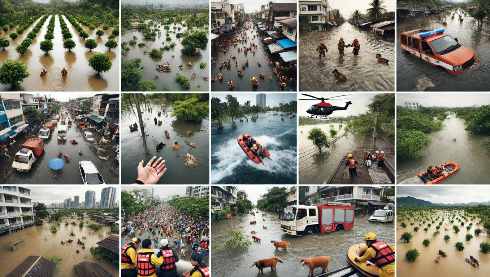
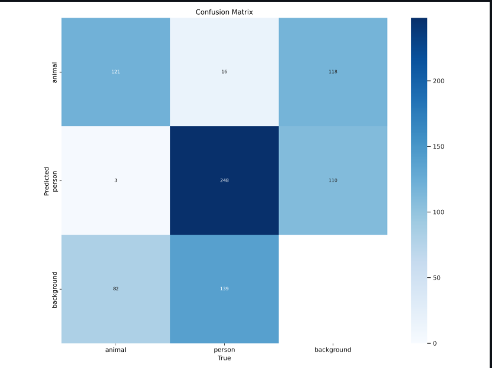
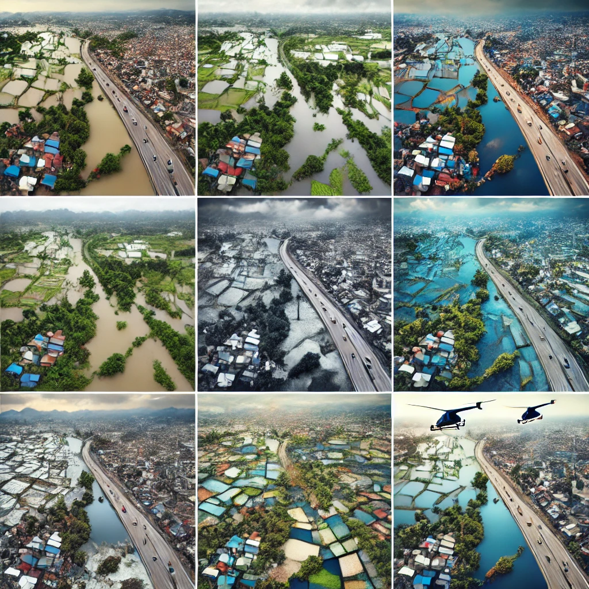

# Apda-Mitra: Disaster Relief and Response Solution

## Overview  
Apda-Mitra is a cutting-edge disaster relief and response system which is designed to enhance the emergency management during natural disasters such as floods and wildfires. This project leverages the **satellite data, **AI-driven analysis, and **drone-based victim detection to improve real-time awareness, optimize the resource distribution and accelerate the disaster response efforts.

## Approach and Key Features  

### 1. **Early Wildfire Detection Using Satellite Imagery**  
- This system employs the advanced satellite data, specifically utilizing **NOAA-20’s VIIRS** (Visible Infrared Imaging Radiometer Suite) sensors, to detect wildfires in their initial stages.  
- By analyzing these satellite feeds, the solution ensures that disaster relief teams receive **timely alerts** and enabling them to take preventive action before the situation escalates.  

### 2. **AI-Powered Drone Surveillance for Flood Rescue**  
- In the flood-affected regions, **drones equipped with high-resolution cameras** are deployed for real-time aerial surveillance.  
- Cutting-edge AI models, such as **YOLOv8**, process drone imagery to detect stranded individuals, helping rescue teams prioritize and streamline evacuation efforts.  

### 3. **Flood Mapping and Risk Assessment via AI**  
- AI-driven image processing techniques, including **semantic segmentation**, are applied to satellite data to analyze **flood extent and impact**.  
- These insights assist emergency responders in making **data-driven decisions**, ensuring efficient deployment of relief resources.  

## Impact and Goals  

- **Faster Disaster Response** → Reduces information lag and provides early warnings to disaster management teams.  
- **Improved Resource Allocation** → AI-driven insights optimize the distribution of food, medical aid, and rescue personnel.  
- **Enhanced Situational Awareness** → Real-time monitoring via satellite and drone imagery ensures a comprehensive understanding of disaster-affected regions.  

By integrating **AI, satellite technology, and drone capabilities**, Apda-Mitra is revolutionizing disaster response strategies, making relief operations more **effective and life-saving**.  

# Victim Detection

#Flood Segmenation

# Four member team to solve a real- world problem - PREDICT & PROTECT
@anshikaagupta
@abhishek8172
@pritu6841
